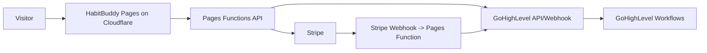

# HabitBuddy Website Implementation Plan

Last updated: February 18, 2026
Owner: HabitBuddy team

## 1) Goal

Launch the redesigned HabitBuddy marketing site with:
- strong conversion UX (aligned with the audit recommendations)
- reliable data sync into GoHighLevel (CRM + workflows)
- Stripe-powered checkout (including gift flow)
- clean deployment path on a free commercial-safe host

## 2) Recommended Architecture (Final)

Use **Cloudflare Pages + Pages Functions** for the public website and API layer, then integrate with **Stripe + GoHighLevel APIs/workflows**.

Why this is the best fit for your case:
- You keep full control over custom UI (forms + checkout UX)
- You avoid GoHighLevel form styling limitations
- You can still push lead/customer lifecycle data back to GoHighLevel
- Cloudflare free tier is viable for launch traffic and commercial use

### High-level flow

## 3) Current State Snapshot (Local Redesign)

From the current local HTML files:
- `/index.html` has improved funnel structure, unified CTA language, pricing/trial messaging, FAQ pricing answer, and light/dark toggle
- `/maxsupport.html` has a real-looking signup form UX, but submit handler is still mock redirect (`window.location.href = 'thankyou.html'`)
- `/giftahabitbuddy.html` has gift plans and gift form UX, but submit handler is still mock redirect (`window.location.href = 'thankyou.html?gift=true'`)
- `/thankyou.html` is present and already supports normal vs gift confirmation state

Meaning: **Design is much stronger now, but backend integrations are not wired yet.**

## 4) Alignment with HabitBuddy Audit Report

Reference report: `/Users/uxie/Downloads/HabitBuddy Audit Report.md`

### Already reflected in redesign
- Pricing transparency added in key places (7-day trial, then monthly)
- CTA language is much more consistent
- Dedicated gift page exists (`/giftahabitbuddy`)
- "How it works" and stronger conversion structure are present
- Light/dark mode support is already implemented

### Still pending (implementation layer)
- Real signup + payment processing
- Real CRM sync to GoHighLevel
- Analytics + event tracking instrumentation
- Operational safeguards (webhook security, idempotency, retries)

## 5) Checkout and CRM Strategy

### Recommended checkout approach

Use **Stripe Checkout Session API** first for fastest reliable launch, then optionally move to full custom Elements checkout later.

Reasoning:
- Stripe Checkout supports subscription + trial quickly
- Faster to production with lower risk
- Still supports branding/customization
- You can later upgrade to Elements for deeper on-page custom control

### Trial policy decision (must finalize)

Choose one of these before implementation:

1. **No-card trial start (recommended for conversion)**
- Start 7-day trial without collecting card
- Collect payment method before trial ends using Stripe email + portal flow
- Better top-of-funnel conversion, more ops follow-up required

2. **Card-on-file trial start**
- Collect card at signup, first charge after 7 days
- Lower friction on billing ops, usually lower signup conversion

## 6) GoHighLevel Data Contract

Create/update these in GoHighLevel first:

### Contact fields (custom)
- `hb_habit_focus` (text/select)
- `hb_checkin_time` (text/select)
- `hb_signup_source` (text; e.g. home/maxsupport/gift)
- `hb_trial_start_at` (date/time)
- `hb_trial_end_at` (date/time)
- `hb_stripe_customer_id` (text)
- `hb_stripe_subscription_id` (text)
- `hb_gift_duration` (text)
- `hb_gift_sender_name` (text)
- `hb_gift_sender_email` (email)

### Tags
- `hb_lead`
- `hb_trial_started`
- `hb_trial_will_end`
- `hb_active_subscriber`
- `hb_payment_failed`
- `hb_churned`
- `hb_gift_sender`
- `hb_gift_recipient`

### Optional opportunities
- Pipeline: `HabitBuddy Sales`
- Stages: `Trial Started`, `Active`, `Payment Failed`, `Canceled`

## 7) Page Flows to Implement

### A) Max Support flow (`/maxsupport`)

1. User submits form (name, phone, habit, check-in time, and add email field)
2. Frontend calls `POST /api/trial/start`
3. Backend validates + normalizes phone/email
4. Backend upserts contact in GoHighLevel
5. Backend creates Stripe customer (or links existing)
6. Backend starts trial path (policy 1 or 2)
7. Backend writes Stripe IDs + tags back to GHL
8. Redirect user to success state (`/thankyou` or Stripe checkout if card-first)

### B) Gift flow (`/giftahabitbuddy`)

1. User selects gift duration and fills sender + recipient details
2. Frontend calls `POST /api/gift/checkout-session`
3. Backend creates Stripe Checkout session for one-time payment (1/3/6 month gift SKU)
4. On successful payment webhook:
- mark sender contact with `hb_gift_sender`
- upsert recipient contact with `hb_gift_recipient`
- store gift metadata (duration, sender, message)
- trigger GHL workflow to start recipient onboarding texts

### C) Stripe webhook flow

`POST /api/webhooks/stripe` handles:
- `checkout.session.completed`
- `invoice.paid`
- `invoice.payment_failed`
- `customer.subscription.updated`
- `customer.subscription.deleted`
- `customer.subscription.trial_will_end`

Each webhook update must sync status/tags/fields back to GoHighLevel.

## 8) API Endpoints to Build (Cloudflare Pages Functions)

- `POST /api/trial/start`
  - validates signup payload
  - upserts GHL contact
  - creates Stripe customer/subscription intent
- `POST /api/gift/checkout-session`
  - validates gift payload
  - creates Stripe checkout session
- `POST /api/webhooks/stripe`
  - verifies Stripe signature
  - idempotent event processing
  - updates GHL data
- `GET /api/health`
  - deploy/runtime health check

## 9) Frontend Changes Required Before Go-Live

### `/maxsupport.html`
- add email input (required if you want external tracking compatibility)
- add `name` attributes on all form fields
- replace `handleSignup` redirect with `fetch('/api/trial/start')`
- surface inline errors + loading state + success redirect

### `/giftahabitbuddy.html`
- add `name` attributes on all fields
- replace `handleGift` redirect with API call + redirect to Stripe Checkout URL
- persist selected duration into request payload

### Tracking script option (optional but useful)
If you use GoHighLevel External Tracking on Cloudflare-hosted pages:
- form must be native `<form>`
- visible fields need valid `name`
- email field is required

## 10) Hosting + Domain Plan (Cloudflare)

### Deployment path
1. Push repo to GitHub
2. Create Cloudflare Pages project from repo
3. Production branch: `main`
4. Add env vars/secrets in Pages settings
5. Attach custom domain
6. Keep preview URLs for QA

### Domain setup
- Apex domain (`tryhabitbuddy.com`) requires Cloudflare nameserver setup
- Subdomain can use CNAME to `<project>.pages.dev` if needed

### Important free-plan limits (current docs)
- Pages free builds: 500/month
- Pages free files: 20,000
- Max single static file: 25 MiB
- Static asset requests: free/unlimited
- Functions requests use Workers free quota (100,000/day)

## 11) Vercel vs Cloudflare Recommendation

For a commercial business site, **Cloudflare Pages free** is usually the better fit here.

Why not Vercel Hobby for this project:
- Vercel docs/ToS state Hobby is non-commercial/personal-only
- Commercial usage generally requires Pro ($20/month + usage)

## 12) Security and Reliability Requirements

- Verify Stripe webhook signatures (`Stripe-Signature`)
- Verify GHL webhook authenticity if used
- Add idempotency key handling for webhook events
- Store processed event IDs to prevent duplicate updates
- Keep API secrets server-side only (never in client JS)
- Add rate limiting and basic anti-bot protection (Cloudflare Turnstile)

## 13) Implementation Phases

### Phase 0 (1-2 days): Foundations
- finalize trial policy (no-card vs card-first)
- finalize Stripe product/price IDs
- create GHL custom fields/tags/workflows
- scaffold Pages Functions endpoints + env setup

### Phase 1 (2-4 days): Core wiring
- connect `/maxsupport` form to `/api/trial/start`
- connect gift form to Stripe checkout session creation
- implement Stripe webhook handler + GHL sync
- add structured error handling + logging

### Phase 2 (1-2 days): QA + launch prep
- end-to-end sandbox tests (signup, trial, gift, failed payment)
- mobile and desktop QA pass
- attach production domain
- soft launch with monitoring

### Phase 3 (post-launch): Optimization
- A/B tests on headline/CTA/order
- optionally migrate checkout UI to Stripe Elements for deeper custom UX
- improve attribution dashboards and funnel analytics

## 14) Testing Checklist

- New trial signup creates/updates GHL contact correctly
- Trial signup creates Stripe customer/subscription as expected
- Gift checkout success creates sender + recipient records
- Webhook retries do not duplicate status updates
- Cancel/refund/payment-failed updates are reflected in GHL
- Thank-you pages reflect correct flow states
- Forms work in mobile Safari/Chrome

## 15) Operational Runbook

Monitor daily for first 2 weeks:
- form submit success rate
- Stripe checkout completion rate
- webhook failure count
- GHL contact sync mismatch count
- trial-to-paid conversion

Set alerts for:
- webhook endpoint >= 1% 5xx
- sudden drop in form submissions
- payment failure spikes

## 16) Open Decisions (Need Team Confirmation)

1. Trial policy: no-card trial vs card-on-file trial
2. Gift fulfillment model: instant recipient enrollment vs redeemable gift code
3. Source of truth for subscription status: Stripe (recommended) with sync into GHL
4. Whether to include GHL external tracking script in addition to direct API sync

## 17) Source References

### Cloudflare
- [Pages Functions pricing](https://developers.cloudflare.com/pages/functions/pricing/)
- [Workers pricing](https://developers.cloudflare.com/workers/platform/pricing/)
- [Pages limits](https://developers.cloudflare.com/pages/platform/limits/)
- [Pages custom domains](https://developers.cloudflare.com/pages/configuration/custom-domains/)

### GoHighLevel
- [External tracking for forms/pageviews](https://help.gohighlevel.com/support/solutions/articles/155000006092-tracking-external-forms-with-gohighlevel)
- [Payment links](https://help.gohighlevel.com/support/solutions/articles/155000002177-payment-links)
- [One-step order form](https://help.gohighlevel.com/support/solutions/articles/155000007238-how-to-add-a-one%E2%80%91step-order-form-to-a-funnel)
- [Custom payments integration](https://help.gohighlevel.com/support/solutions/articles/155000002620-how-to-build-a-custom-payments-integration-on-the-platform)
- [Hydration event for custom code](https://help.gohighlevel.com/support/solutions/articles/155000002421-hydration-event-in-custom-code-in-funnels)
- [HighLevel Contacts API auth](https://marketplace.gohighlevel.com/docs/ghl/contacts/contacts-api/index.html)
- [Upsert Contact endpoint](https://marketplace.gohighlevel.com/docs/ghl/contacts/upsert-contact/index.html)
- [Add Contact to Workflow endpoint](https://marketplace.gohighlevel.com/docs/ghl/contacts/add-contact-to-workflow/index.html)
- [Update Opportunity endpoint](https://marketplace.gohighlevel.com/docs/ghl/opportunities/update-opportunity/index.html)
- [Webhook Integration Guide](https://marketplace.gohighlevel.com/docs/webhook/WebhookIntegrationGuide/index.html)
- [Node SDK](https://marketplace.gohighlevel.com/docs/sdk/node/index.html)

### Stripe
- [Checkout overview](https://docs.stripe.com/payments/checkout)
- [Elements Appearance API](https://docs.stripe.com/elements/appearance-api)
- [Webhook security](https://docs.stripe.com/webhooks)
- [Subscription trials](https://docs.stripe.com/billing/subscriptions/trials)
- [SaaS subscriptions guide](https://docs.stripe.com/get-started/use-cases/saas-subscriptions)

### Vercel
- [Vercel pricing](https://vercel.com/pricing)
- [Fair use guidelines](https://vercel.com/docs/limits/fair-use-guidelines)
- [Terms of service](https://vercel.com/legal/terms)
